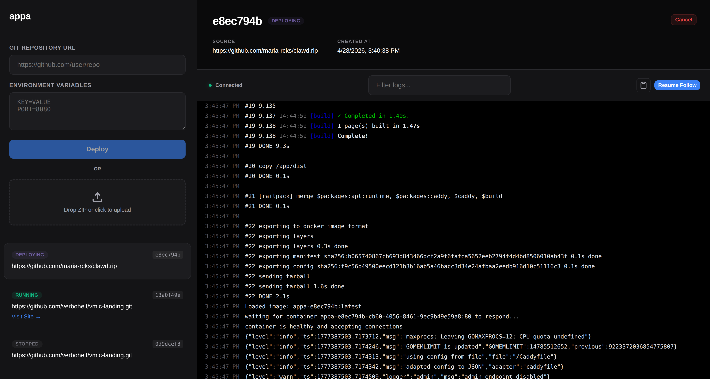

# appa

**Appa** is a minimal, zero-config deployment platform that handles building, orchestration, and routing with ease.



### [What this project is about]

I figured I'd try my hands on the Brimble take-home task and try my chops on Go for infra stuff. Turns out, I became a little more excited about software lately doing this. It's named Appa, after Aang's flying bison, simply because I just wanted to... and I somehow like to associate stuff I do with my fav cartoon show growing up. Anyway, without further ado, enter Appa: A minimal deployment platform.

### [How it works]

```text
User/UI  ──►  Go Backend  ──►  Railpack (Build)  ──►  Docker (Run)  ──►  Caddy (Route)
   ▲              │                 │                   │                 │
   └──────────────┴─────────────────┴───────────────────┴─────────────────┘
                          (Live Logs via WebSockets)
```

### [The Tech]

The stack is pretty lean. I used **Go** for the backend because I wanted that raw performance and concurrency for handling the pipeline.

- **Builder**: It uses **Railpack** to handle zero-config builds. It basically looks at your code, figures out what it is, and builds a container for it.
- **Orchestration**: I'm using the **Moby** (Docker) SDK to manage the container lifecycle.
- **Routing**: I'm hitting the **Caddy Admin API** directly to dynamically provision routes. Every deployment gets its own `<id>.localhost` subdomain without me having to touch a Caddyfile.
- **Persistence & Logs**: **SQLite** handles the data, and I'm using **WebSockets** to stream build and runtime logs live to the UI.
- **Frontend**: A standard **React** setup with **TanStack** (Router & Query) for state and navigation.

### [Wait, how does it build?]

Thanks to **Railpack**, Appa is language-agnostic. It detects your environment and builds an optimized image for:
- **Node.js** (npm, yarn, pnpm)
- **Python** (pip, poetry)
- **Go**
- **Rust**
- **Static Sites** (HTML/CSS/JS)
- ...and more, all without having a `Dockerfile`.

### [What it can do]

- [x] **Zero-Config Builds**: Point it at a repo or upload a folder and it just works.
- [x] **Live Logging**: Watch your build and runtime logs stream in real-time.
- [x] **Dynamic Subdomains**: Every app gets its own URL automatically.
- [x] **Self-Healing Routes**: If the server restarts, Appa syncs back up with Caddy to restore all your routes.
- [x] **Environment Variables**: Easily inject secrets and config into your deployments.

### [API Overview]

If you want to poke at it via `curl` or Postman:

- `GET    /deployments` - List all deployments.
- `POST   /deployments` - Trigger a Git-based deployment.
- `POST   /deployments/upload` - Deploy via a ZIP file upload.
- `PATCH  /deployments/{id}` - Cancel an active deployment or stop a container.
- `GET    /deployments/{id}/logs` - WebSocket endpoint for live log streaming.

### [Getting it running]

**Prerequisites:**
- **Docker** & **Docker Compose**
- A terminal and some curiosity.

```bash
git clone https://github.com/theolujay/appa.git
cd appa
docker compose up --build
```
- Open localhost in your browser

### [Ideas for later]

- **Build Caching**: Mounting a persistent volume for Railpack's cache so rebuilds don't have to start from scratch every time.
- **Resource Limits**: Using the Docker API to set strict CPU and memory limits per container to prevent one app from hogging everything.
- **Rollbacks**: The ability to instantly switch back to a previous successful image tag if a new deployment goes south.
- **Scaling**: Adding support for horizontal scaling -- deploying multiple instances of the same app and load balancing between them.
- **Improved reliability**: Handle edge cases and possible faults to minimize failures.
- **More buttons?**: I dunno, buttons are cool. Not too many, though. Just a few more "controls", I guess.

### [Stuff I learned along the way]

It took me way longer than I anticipated to build this, but we're here now. Had some bad advice along the way; AI be misleading me with old info (like leading me to stuff from docker/docker pkg rather than moby/moby)... can't complain, though, as it helped with the UI and allowing me focus more on the backend & infra stuff. Along the way building, some interesting ideas came to mind; I had to first lock in on the core stuff, so maybe I'll explore the ideas later on. Ultimately, I think my biggest realization doing this was the complexity that goes into building IaaS and PaaS systems. Had these "Oh, now I see" moments.
